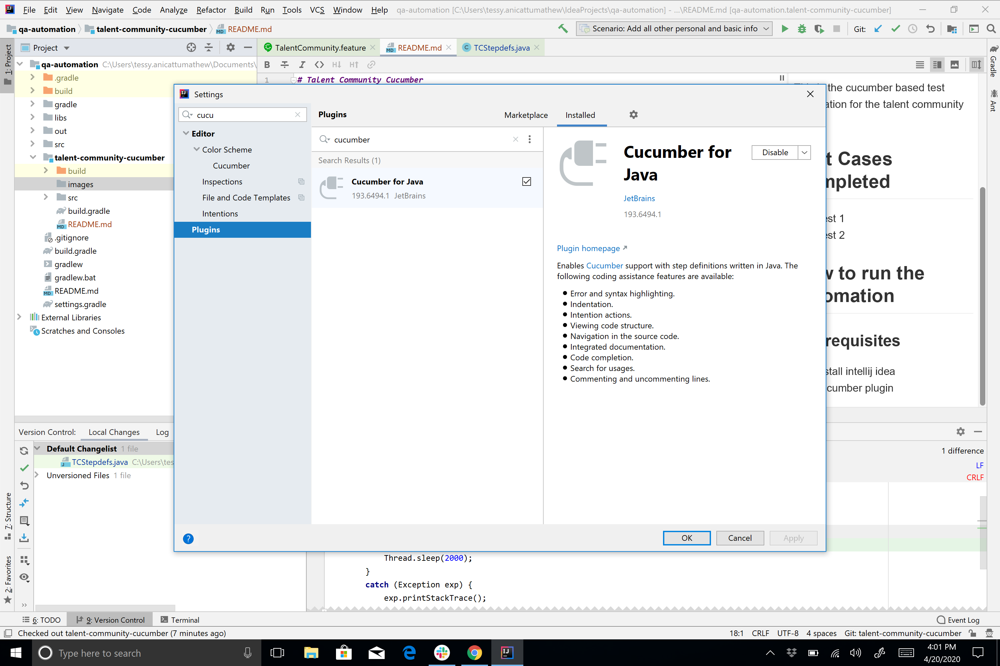
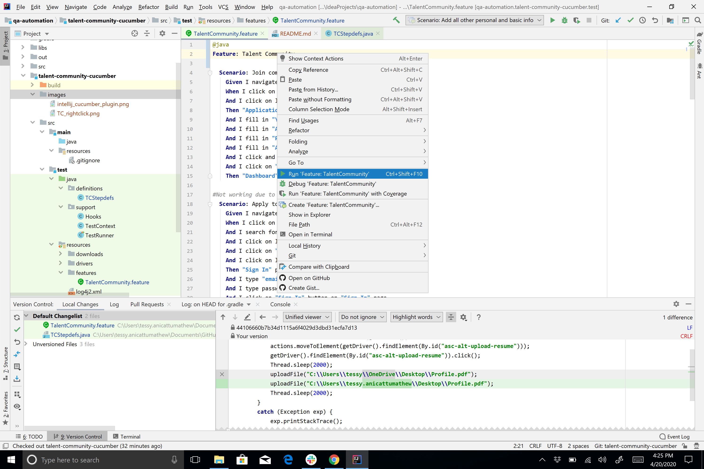

# Test Cases in Cucumber

## Overview

This is the cucumber based test automation for the talent community and test community portal.

## How to run the automation

### Pre-requisites

* Install IntelliJ Idea community edition
* Install Cucumber plugin

### Steps to run each scenario
1. Open [TalentCommunity.feature](src/test/resources/features/TalentCommunity.feature) file in IntelliJ
1. Right-click on any step inside a scenario. See the below image for reference.

1. Click on "Run Scenario" menu item

### Steps to run all scenarios
1. Open [TalentCommunity.feature](src/test/resources/features/TalentCommunity.feature) file in IntelliJ
1. Right-click on the "feature". See the below image for reference.

1. Click on "Run Feature" menu item

## Known Issues
1. Scenario "Apply to a job by sign-in to a community" is not working currently due to change (bug) in workflow.
 [Jira](https://ascendify.atlassian.net/browse/MV-16386)
1. To successfully run the scenario "Apply to a job by uploading your resume", copy the path/location of a file to be 
uploaded and paste it in [TCStepdefs.java](src/test/java/definitions/TCStepdefs.java) file. Look for the "NOTE: The 
upload file path must be changed before running the scenario".

1. To successfully run the scenario "Login/SignUp via Social", a valid LinkedIn email and password needs to be used/pasted that 
is not present in the Ascendify Database. Look for the "NOTE:Use a valid LinkedIn email and password that is not present in the Ascendify Database" in [TalentCommunity.feature](src/test/resources/features/TalentCommunity.feature) file.
