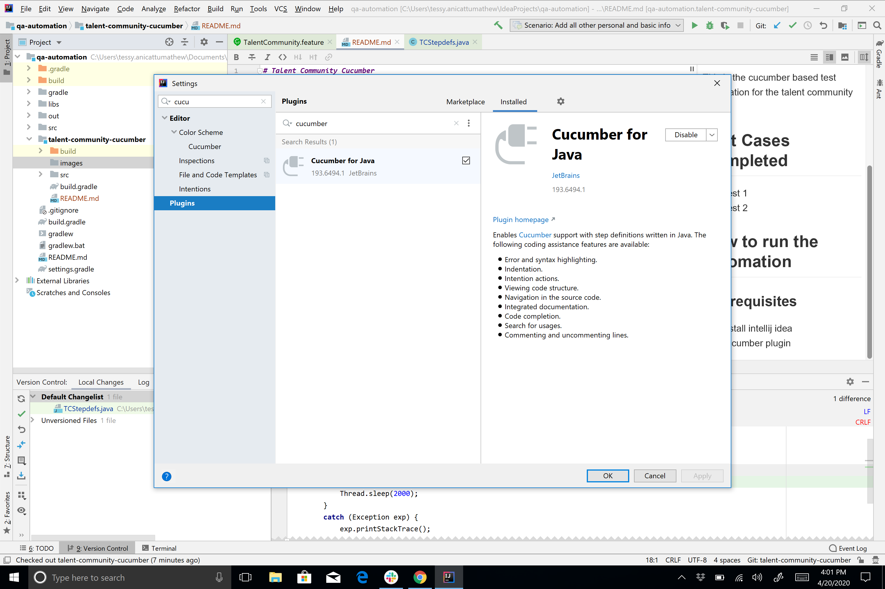
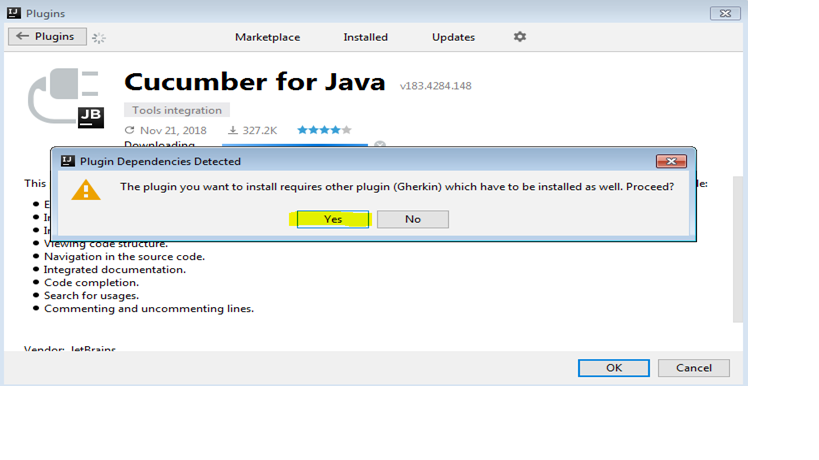
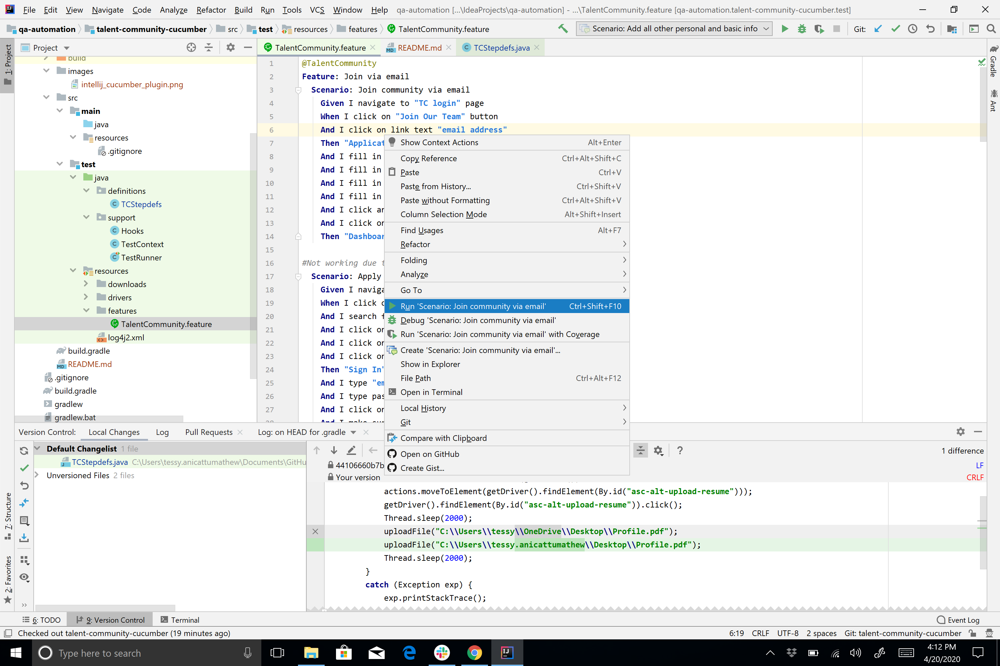
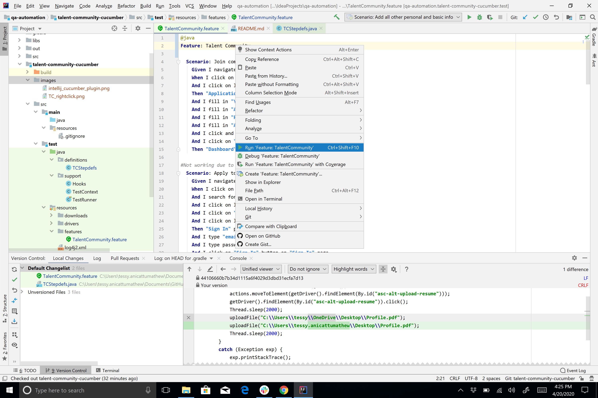
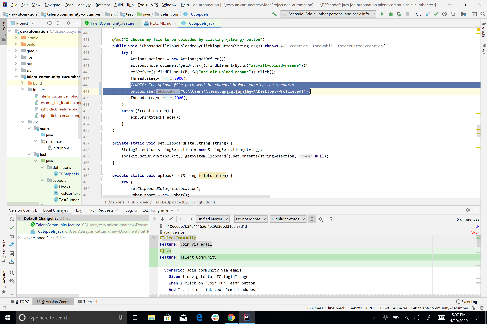
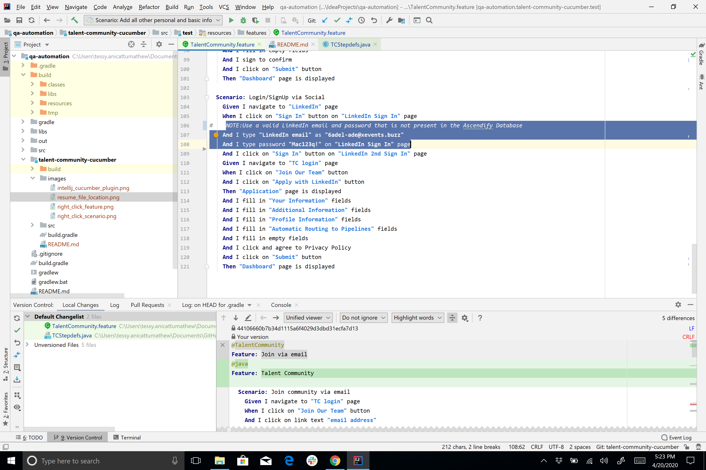

# Test Cases in Cucumber

## Overview

This is the cucumber based test automation for the talent community and test community portal.

## How to run the automation

### Pre-requisites

* Install Java (Java 8 is recommended)
* Install IntelliJ IDEAcommunity edition
* Install "Cucumber for Java" plugin in IntelliJ IDEA
* Install "Gherkin" plugin in IntelliJ IDEA
* Install Selenium WebDriver [optional]

### Steps to run each scenario Eg: Talent Community
1. Open [TalentCommunity.feature](src/test/resources/features/TalentCommunity.feature) file in IntelliJ
1. Right-click on any step inside a scenario. See the below image for reference.

1. Click on "Run Scenario" menu item

### Steps to run all scenarios
1. Open [TalentCommunity.feature](src/test/resources/features/TalentCommunity.feature) file in IntelliJ
1. Right-click on the "feature". See the below image for reference.

1. Click on "Run Feature" menu item

## Known Issues
1. Scenario "Apply to a job by sign-in to a community" is not working currently due to change (bug) in workflow.
 [Jira](https://ascendify.atlassian.net/browse/MV-16386)
1. To successfully run the scenario "Apply to a job by uploading your resume", copy the path/location of a file to be 
uploaded and paste it in [TCStepdefs.java](src/test/java/cucumber.mainmenu.definitions/TCStepdefs.java) file. Look for the "NOTE: The 
upload file path must be changed before running the scenario".

1. To successfully run the scenario "Login/SignUp via Social", a valid LinkedIn email and password needs to be used/pasted that 
is not present in the Ascendify Database. Look for the "NOTE:Use a valid LinkedIn email and password that is not present in the Ascendify Database" in [TalentCommunity.feature](src/test/resources/features/TalentCommunity.feature) file.

1. Credentials : Username/Password can be changed either in the Step Definitions Java files or in the Feature files.
1. ALL steps in the Feature file are ended with an abbreviation corresponding to the feature file to avoid step duplication conflict while running the java script.
Eg: 
    * MM for Main Menu
    * PT for People Tab
    * REQ for Requisitions Tab
    * TC for Talent Community 